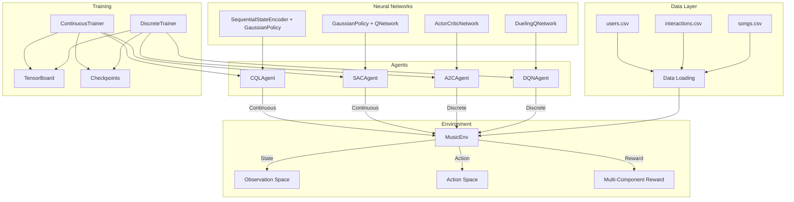
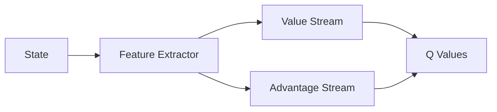
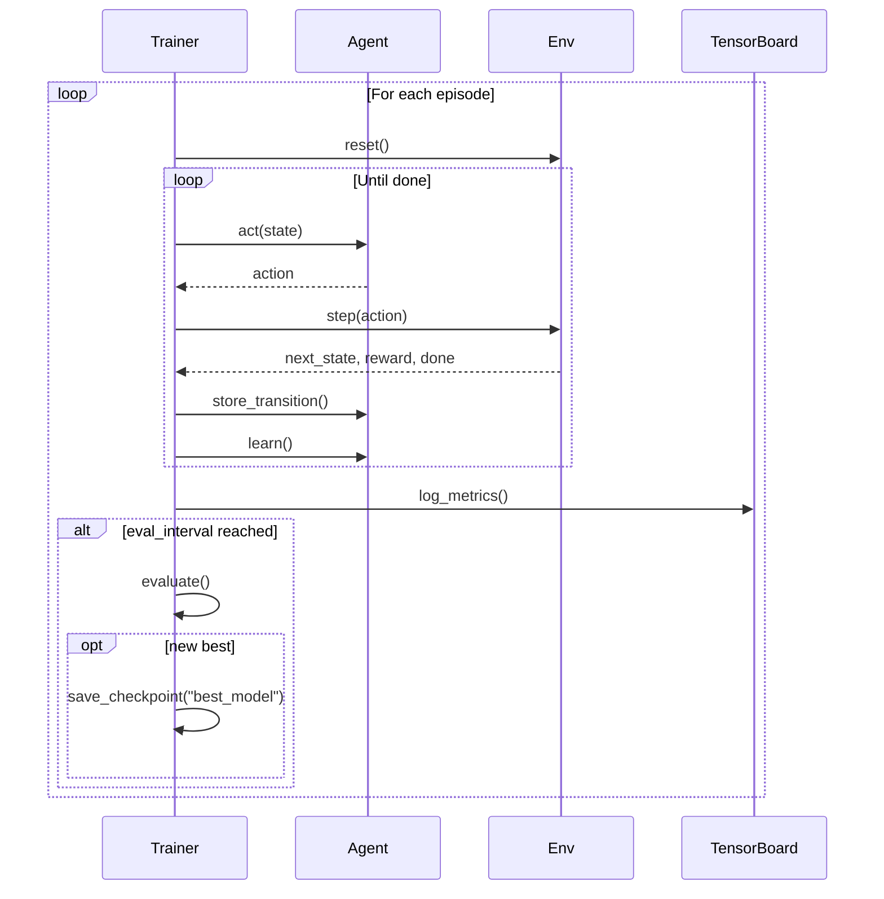
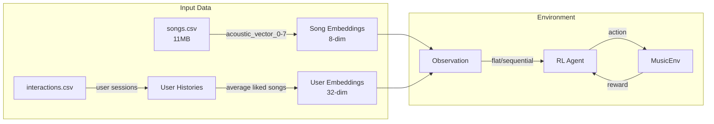

# 🎵 MUSIQ Project - Comprehensive Analysis

A deep-dive analysis of the RL-based Music Recommendation System.

---

## Project Overview

**MUSIQ** is a Reinforcement Learning-based Music Recommendation System that simulates a music streaming environment where an RL agent learns to recommend songs to users based on their listening behavior. The goal is to maximize long-term user engagement by learning from user reactions (skip, partial listen, complete listen).

### Key Capabilities
- **Multiple RL Algorithms**: DQN, A2C, SAC, and CQL
- **Dual Action Spaces**: Discrete (song index selection) and Continuous (embedding-based recommendation)
- **Advanced Neural Architectures**: Dueling DQN, Attention mechanisms, Transformer encoders
- **Comprehensive Reward System**: Multi-component rewards balancing engagement, diversity, and personalization

---

## Architecture Diagram



---

## Core Components

### 1. Environment (`src/envs/music_env.py`)

The **MusicEnv** is a Gymnasium-compatible RL environment that simulates a music streaming session.

#### Observation Space
Flat or sequential format containing:
- **User embedding** (`user_embed_dim` = 32)
- **Recent track embeddings** (`num_recent_tracks × song_embed_dim` = 5×8 = 40)
- **Context features** (4): hour_of_day, session_position, session_progress, time_since_last

| Format | Shape | Description |
|--------|-------|-------------|
| Flat | `(76,)` | 32 + 40 + 4 = 76 dimensions |
| Sequential | `(20, 44)` | 20 timesteps × (8+32+4) features |

#### Action Space
| Mode | Type | Description |
|------|------|-------------|
| Discrete | `Discrete(N)` | Select song by index (N = num_songs) |
| Continuous | `Box(-1, 1, shape=(8,))` | Output embedding, find nearest song |

#### Multi-Component Reward Function

```python
reward = base_reward + diversity_bonus + personalization_bonus + engagement_bonus
```

| Component | Value | Condition |
|-----------|-------|-----------|
| Full listen | +1.0 | User completes song |
| Partial listen | +0.5 | User listens partially |
| Skip | -0.5 | User skips early |
| Diversity | ±0.2 weight | Avoids repetition |
| Personalization | ±0.3 weight | Matches user preference |
| Session engagement | ±0.1 weight | Longer sessions bonus |

#### User Behavior Simulation
The environment simulates user reactions based on:
1. **Cosine similarity** between user embedding and song embedding
2. **Noise injection** for stochasticity
3. **Repetition penalty** (50% similarity reduction for recently played songs)

```python
# Thresholds
similarity < 0.3  →  Skip
0.3 ≤ similarity < 0.6  →  Partial listen
similarity ≥ 0.6  →  Full listen
```

---

### 2. RL Agents

#### 2.1 DQN Agent (`src/agents/dqn_agent.py`)

**Deep Q-Network** with advanced features:
- **Double DQN**: Uses online network for action selection, target for evaluation
- **Dueling Architecture**: Separate value and advantage streams
- **Epsilon-greedy exploration**: Decays from 1.0 → 0.01

Key hyperparameters:
```yaml
learning_rate: 1e-4
gamma: 0.99
epsilon_decay: 50000 steps
target_update_freq: 1000 steps
batch_size: 64
buffer_size: 100000
```

**Learning Algorithm**:
```python
# Standard DQN
Q(s,a) ← r + γ * max_a'[Q_target(s', a')]

# Double DQN (used)
a* = argmax_a'[Q_online(s', a')]
Q(s,a) ← r + γ * Q_target(s', a*)
```

---

#### 2.2 A2C Agent (`src/agents/a2c_agent.py`)

**Advantage Actor-Critic** for on-policy learning:
- Shared feature extractor with actor and critic heads
- N-step returns for better credit assignment
- Entropy regularization for exploration

Key hyperparameters:
```yaml
learning_rate: 3e-4
gamma: 0.99
value_loss_coef: 0.5
entropy_coef: 0.01
n_steps: 5
max_grad_norm: 0.5
```

**Loss Function**:
```python
L = L_policy + 0.5 * L_value + 0.01 * L_entropy
L_policy = -log_prob * advantage
L_value = MSE(V(s), returns)
L_entropy = -H(π(·|s))
```

---

#### 2.3 SAC Agent (`src/agents/sac_agent.py`)

**Soft Actor-Critic** for continuous action spaces with maximum entropy:
- Gaussian policy with reparameterization trick
- Twin Q-networks (clipped double-Q)
- Automatic entropy tuning

Key hyperparameters:
```yaml
learning_rate: 3e-4
gamma: 0.99
tau: 0.005  # soft update coefficient
alpha: 0.2  # entropy temperature
automatic_entropy_tuning: true
batch_size: 256
buffer_size: 1000000
```

**Learning Algorithm**:
```python
# Q-function update
Q(s,a) ← r + γ * (min(Q1_target, Q2_target)(s', a') - α * log π(a'|s'))

# Policy update
L_policy = α * log π(a|s) - min(Q1, Q2)(s, a)

# Entropy tuning
α ← α - lr * (log π(a|s) + target_entropy)
```

---

#### 2.4 CQL Agent (`src/agents/cql_agent.py`)

**Conservative Q-Learning** extends SAC for offline RL:
- Adds conservative penalty to prevent overestimation
- Designed for learning from static datasets

Key hyperparameters:
```yaml
cql_weight: 1.0      # conservative loss weight
temp: 1.0            # logsumexp temperature
min_q_weight: 10.0   # minimum Q-value weight
```

**CQL Loss**:
```python
# Standard SAC Q-loss
L_mse = MSE(Q(s,a), target)

# CQL penalty (prevents overestimation)
L_cql = logsumexp(Q(s, a_random, a_policy, a_dataset)) - Q(s, a_dataset)

# Total Q-loss
L_Q = L_mse + cql_weight * L_cql
```

---

### 3. Neural Network Architectures (`src/networks/`)

#### 3.1 Feature Extractor with Attention
```python
FeatureExtractor(
    input_dim → hidden_dims → [LayerNorm → ReLU → Dropout]
    → Optional[MultiHeadAttention(4 heads)]
)
```

#### 3.2 Dueling Q-Network


#### 3.3 Gaussian Policy (SAC)
```python
GaussianPolicy:
    state → FeatureExtractor → (mean_head, log_std_head)
    → Normal(μ, σ) → rsample() → tanh(z) → action
```

#### 3.4 Transformer Sequential Encoder
For processing listening history as sequences:
```python
SequentialStateEncoder:
    (batch, seq_len, input_dim)
    → Linear embedding
    → PositionalEncoding
    → TransformerEncoder(2 layers, 4 heads)
    → last_token[:, -1, :]
    → (batch, hidden_dim)
```

---

### 4. Replay Buffers (`src/replay_buffers/replay_buffer.py`)

| Buffer Type | Use Case | Key Feature |
|-------------|----------|-------------|
| `ReplayBuffer` | DQN, SAC, CQL | Standard uniform sampling |
| `PrioritizedReplayBuffer` | DQN-PER | Priority-based sampling with IS weights |
| `NStepReplayBuffer` | N-step DQN | Multi-step return calculation |
| `RolloutBuffer` | A2C, PPO | On-policy episode storage |

---

### 5. Training Pipeline (`src/trainers/`)



---

### 6. Configuration System (`src/config/base_config.py`)

Pydantic-based validated configuration with hierarchical structure:

```yaml
Config:
  ├── EnvConfig
  │   ├── data_path, mode, max_session_length
  │   ├── reward weights (full, partial, skip, diversity...)
  │   └── user behavior thresholds
  ├── TrainingConfig
  │   ├── algorithm, num_episodes, intervals
  │   ├── warmup_steps, grad_clip
  │   └── experiment tracking (wandb, tensorboard)
  ├── DQNConfig / A2CConfig / SACConfig
  │   ├── learning_rate, gamma, batch_size, buffer_size
  │   └── NetworkConfig (hidden_dims, attention settings)
```

---

## Data Flow



---

## Key Algorithms Summary

| Algorithm | Action Space | Network | Update | Best For |
|-----------|--------------|---------|--------|----------|
| **DQN** | Discrete | Dueling Q-Network | Off-policy, TD | Large discrete catalogs |
| **A2C** | Discrete | Actor-Critic | On-policy, n-step | Stable learning |
| **SAC** | Continuous | Gaussian + Twin Q | Off-policy, max-entropy | Exploration |
| **CQL** | Continuous | SAC + Conservative | Offline RL | Static datasets |

---

## Project Structure Summary

```
MUSIQ/
├── main.py                      # CLI entry point (train/eval)
├── config/                      # YAML configurations
│   ├── dqn_config.yaml
│   ├── a2c_config.yaml
│   ├── sac_config.yaml
│   └── cql_config.yaml
├── src/
│   ├── agents/                  # RL agent implementations
│   │   ├── base_agent.py        # Abstract base class
│   │   ├── dqn_agent.py         # Double DQN + Dueling
│   │   ├── a2c_agent.py         # Advantage Actor-Critic
│   │   ├── sac_agent.py         # Soft Actor-Critic
│   │   └── cql_agent.py         # Conservative Q-Learning
│   ├── envs/
│   │   └── music_env.py         # Gymnasium environment
│   ├── networks/
│   │   ├── networks.py          # DQN, A2C, SAC networks
│   │   └── sequential_network.py # Transformer encoder
│   ├── replay_buffers/
│   │   └── replay_buffer.py     # Standard, PER, N-step, Rollout
│   ├── trainers/
│   │   ├── base_trainer.py      # Training loop, logging
│   │   ├── discrete_trainer.py  # DQN, A2C trainers
│   │   └── continuous_trainer.py # SAC, CQL trainers
│   ├── config/
│   │   └── base_config.py       # Pydantic config classes
│   └── utils/
│       ├── utils.py             # Logging, seeding, device
│       └── metrics.py           # Evaluation metrics
├── scripts/
│   ├── train.py                 # Training script
│   ├── evaluate.py              # Evaluation script
│   ├── inference.py             # Interactive recommendation CLI
│   ├── hyperparameters.py       # Optuna hyperparameter tuning
│   └── visualize_results.py     # Training visualization
├── data/
│   ├── songs.csv                # Song metadata + acoustic vectors
│   ├── users.csv                # User metadata
│   └── raw/interactions.csv     # Listening history
├── checkpoints/                 # Saved models
├── logs/                        # Training logs
└── runs/                        # TensorBoard logs
```

---

## Usage Examples

### Training
```bash
# Train DQN (discrete actions)
python main.py train --algorithm dqn --num-episodes 5000

# Train SAC (continuous actions)
python main.py train --algorithm sac --config config/sac_config.yaml

# Train CQL with Transformer encoder
python main.py train --algorithm cql --config config/cql_config.yaml
```

### Evaluation
```bash
python main.py eval --config config/dqn_config.yaml --checkpoint checkpoints/best_model.agent.pt
```

### Interactive Inference
```bash
python scripts/inference.py recommend --config config/dqn_config.yaml --checkpoint checkpoints/best_model.agent.pt --interactive
```

---

## Summary

The MUSIQ project is a well-structured, modular RL system for music recommendation that demonstrates:

1. **Modern RL algorithms** (DQN, A2C, SAC, CQL) with appropriate network architectures
2. **Flexible environment design** supporting both discrete and continuous action spaces
3. **Advanced features** like attention mechanisms, Transformer encoders, and prioritized replay
4. **Comprehensive training infrastructure** with logging, checkpointing, and visualization
5. **Clean configuration management** using Pydantic validation

The system is designed to learn optimal song recommendations by balancing user engagement (completion rates) with diversity and personalization, creating a nuanced recommendation policy that adapts to individual user preferences over time.
